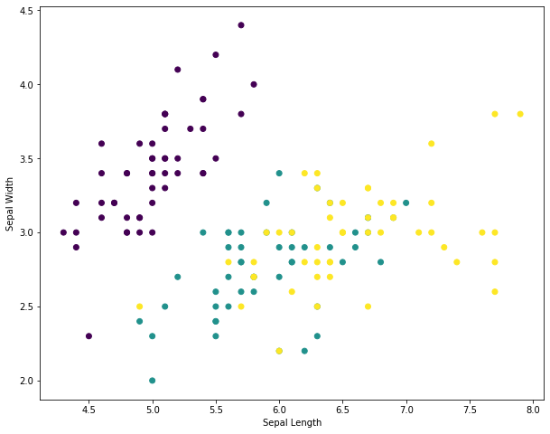
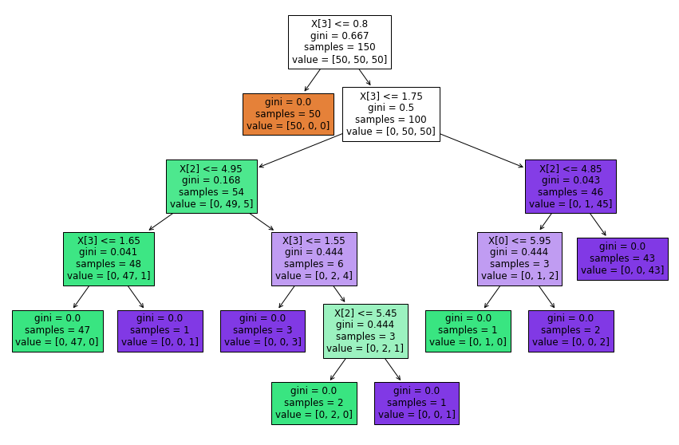

# Quick start at Machine Learning with Scikit-Learn

#### This is the first class topic of Machine Learning at TPAA6 discipline at [IFSP-CJO](ifspcjo.edu.br).

&nbsp;

> Simple example of Machine Learning with [DecisionTreeClassifier](https://scikit-learn.org/stable/modules/generated/sklearn.tree.DecisionTreeClassifier.html?highlight=decisiontree) of [scikit-learn](scikit-learn.org/) library using [Iris Dataset](https://scikit-learn.org/stable/modules/generated/sklearn.datasets.load_iris.html?highlight=iris#sklearn.datasets.load_iris).

---

## Scatter Plot with Matlablib
<p>
    
</p>

## Decision Tree Result
<p>
    
</p>

---

## Build With
 - [Matlab](https://matplotlib.org)
 - [Jupyter Lab](https://jupyterlab.readthedocs.io/en/stable/)
    - [Python3](https://www.python.org/download/releases/3.0/)

---

## Instalation
```bash 
$ pip install -U matplotlib
$ pip install -U scikit-learn
```

---

## Usage
To use <project_name>, follow these steps:

Step 1

- Open the [iris-scikitlearn.ipynb](notebook/iris-scikitlearn.ipynb) file on Jupyter Lab and run it.

Step 2

- Execute the model analysis script to get the performance of Decision Tree

---

## Contributing

1. [Fork this repository][fork].
2. [Create a branch][branch]: ```$ git checkout -b <branch_name>```
3. Make your changes and commit them: ```$ git commit -m '<commit_message>'```
4. Push to the original branch: ```$ git push origin <project_name>/<location>```
5. [Create the pull request][pr] of the fork branch to our `master`.

[fork]: https://help.github.com/articles/fork-a-repo/
[branch]: https://help.github.com/articles/creating-and-deleting-branches-within-your-repository
[pr]: https://help.github.com/articles/using-pull-requests/

---

## References
Based on [Flavio Souza](https://github.com/flaviol-souza) class check his disciplines at [web profile](https://www.flaviosouza.net/disciplinas).

---

## Contributors

<table>
  <tr>
    <td align="center">
        <a href="https://github.com/lucasvma">
            <br />
            <sub><b>Lucas Ventura</b></sub>
        </a><br />
        <a title="Code">💻 </a>
        <a title="Study">📖</a>
    </td>
  </tr>
</table>
